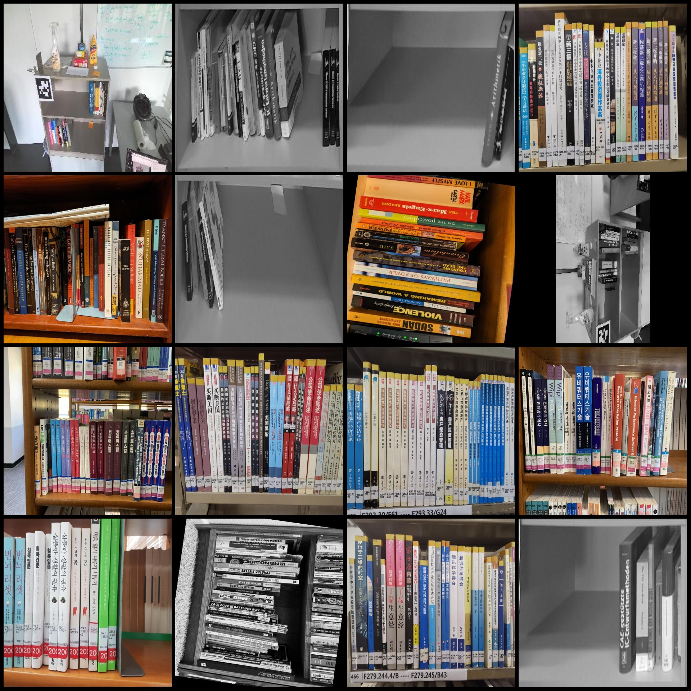
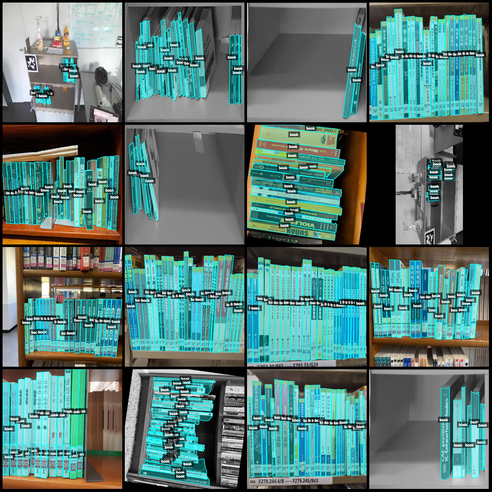
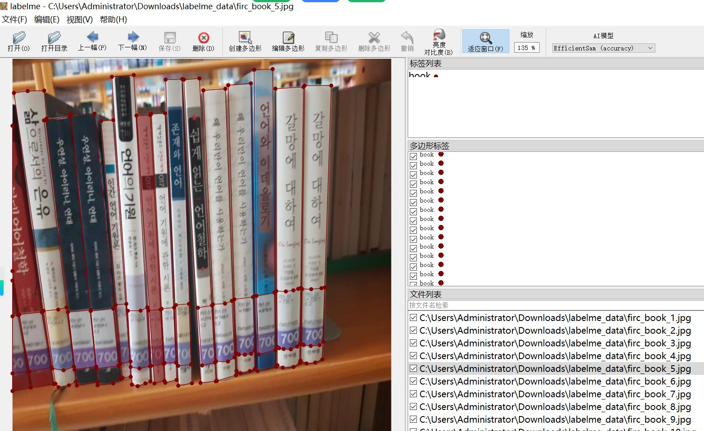

# Smart Book Shelf Identification and Segmentation Dataset (labelme format, 2100 images in one category)

Dataset format: labelme format (without mask files, only containing jpg images and corresponding json files)
Number of images (number of jpg files): 2100
Number of annotations (json file count): 2100
Number of categories: 1
Category name: "book"
Number of bounding boxes per category: 36131
Total number of bounding boxes: 36131
Annotation tool used: labelme = 5.5.0
Image resolution: 640x640
Annotation rules: Polygons are drawn around the category
Important note: The dataset can be edited using labelme, but the json dataset needs to be converted into a mask or YOLOF format or COCO format for semantic segmentation or instance segmentation.
Special declaration: This dataset does not guarantee the accuracy of the trained model or weight files.
Example images preview:
Annotation example:
Original image (randomly selected 16 images):
Annotation drawing result:
Labelme editing example image:

## Images

Here is a pay link on Stripe ( https://buy.stripe.com/3cs8yP7sY87d0vu9AB ). Please contact me lonlonago@foxmail.com after funding $89, and I will send you a complete data files , thank you!

